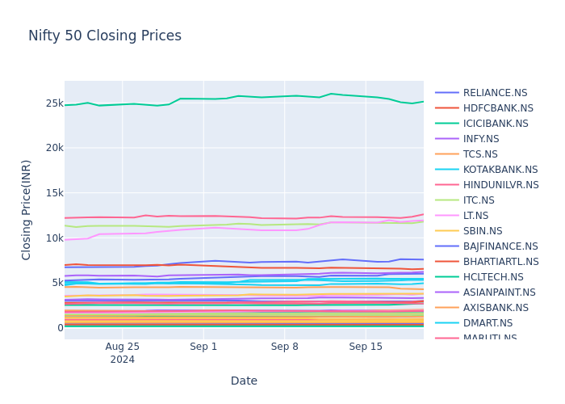
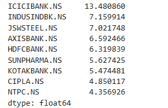
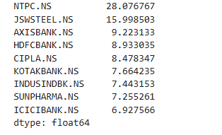
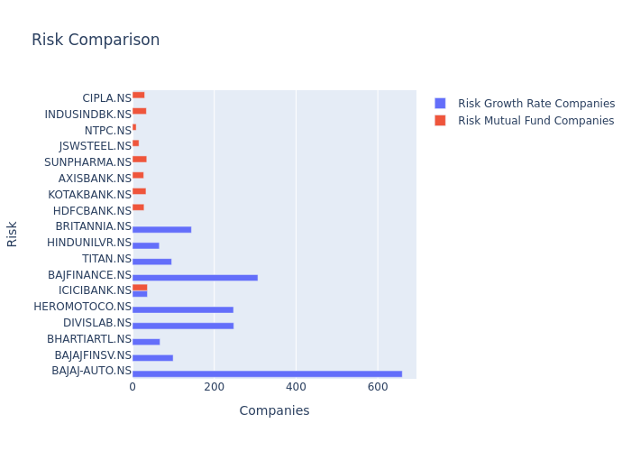

# 📈 Nifty 50 Stock Analysis using Python & Plotly

This project analyzes the historical closing prices of Nifty 50 companies using Python and interactive visualizations with Plotly. The goal is to explore trends, calculate returns and risks, and identify the best investment opportunities based on ROI and volatility.

---

## 📂 Dataset

The dataset used is `nifty50_closing_prices.csv`, containing the daily closing prices of Nifty 50 companies along with dates.

---

## 🛠️ Libraries Used

```python
import pandas as pd
import plotly.graph_objects as go
import plotly.express as px
import warnings
warnings.filterwarnings('ignore')
```

---

## 🔍 Key Operations & Analysis

### 1. **Data Loading and Cleaning**

```python
data = pd.read_csv(r'nifty50_closing_prices.csv')
data['HDFC.NS'] = data['HDFC.NS'].fillna(data['HDFC.NS'].mean())
data['Date'] = pd.to_datetime(data['Date'])
```

---

### 2. **Trend Visualization**

```python
fig = go.Figure()
for comp in data.columns[1:]:
    fig.add_trace(go.Scatter(x=data['Date'], y=data[comp], name=comp))
fig.update_layout(title='Nifty 50 Closing Prices', xaxis_title='Date', yaxis_title='Closing Price(INR)')
fig.show()
```

---

### 3. **Volatility Calculation**

```python
all_companies = data.columns[1:]
volatility_all_companies = data[all_companies].std()
print(volatility_all_companies.sort_values(ascending=False).head(10))
```

---

### 4. **Return Calculation**

```python
growth_all_companies = data[all_companies].pct_change() * 100
average_growth_allcompanies = growth_all_companies.mean()
print(average_growth_allcompanies.sort_values(ascending=False).head(10))

initial_price_all = data[all_companies].iloc[0]
final_price_all = data[all_companies].iloc[-1]
roi_all_companies = ((final_price_all - initial_price_all) / initial_price_all) * 100
print(roi_all_companies.sort_values(ascending=False).head(10))
```

---

### 5. **High ROI, Low Volatility Stocks**

```python
volatility_threshold = volatility_all_companies.median()
roi_threshold = roi_all_companies.median()
selected_companies = roi_all_companies[(roi_all_companies > roi_threshold) & (volatility_all_companies < volatility_threshold)]
print(selected_companies.sort_values(ascending=False))
```

---

### 6. **Investment Allocation Strategy**

```python
selected_volatility = volatility_all_companies[selected_companies.index]
inverse_volatility = 1 / selected_volatility
investment_ratio = (inverse_volatility / inverse_volatility.sum()) * 100
print(investment_ratio.sort_values(ascending=False))
```

---

### 7. **Risk Comparison Plot**

```python
top_growth_companies = average_growth_allcompanies.sort_values(ascending=False).head(10)
risk_growth_rate_companies = volatility_all_companies[top_growth_companies.index]
risk_mutual_fund_companies = volatility_all_companies[selected_companies.index]

fig = go.Figure()
fig.add_trace(go.Bar(y=top_growth_companies.index, x=risk_growth_rate_companies, name='Risk Growth Rate Companies', orientation='h'))
fig.add_trace(go.Bar(y=selected_companies.index, x=risk_mutual_fund_companies, name='Risk Mutual Fund Companies', orientation='h'))
fig.update_layout(title='Risk Comparison', xaxis_title='Companies', yaxis_title='Risk')
fig.show()
```

---

## 🚀 How to Run

1. Install the required libraries:
   ```bash
   pip install pandas plotly
   ```

2. Update the path to your `nifty50_closing_prices.csv` file in the script:
   ```python
   data = pd.read_csv(r'path_to_your_file.csv')
   ```

3. Run the script and explore the interactive plots.

---

## 📌 Notes

- Ensure your CSV file has a `Date` column and closing prices for all companies.
- This analysis assumes no dividend or stock split adjustment.
- You can expand the script to include other technical indicators for deeper analysis.

---

## 📬 Contact

Feel free to reach out if you want to discuss further improvements or collaborate!

If you like this project, please consider leaving a ⭐️  on the repository to show your support!

